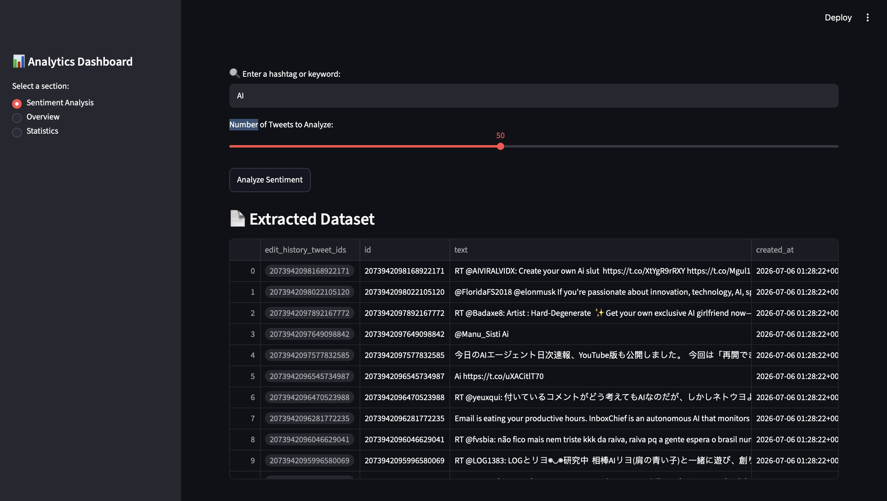
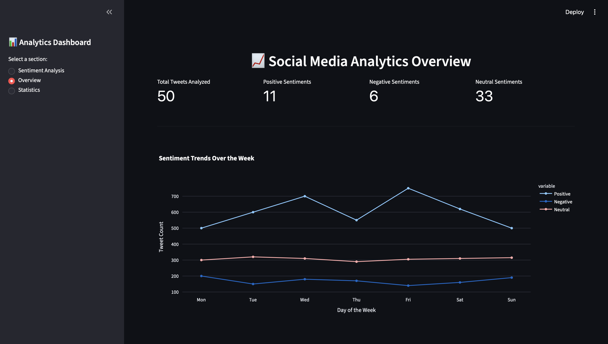
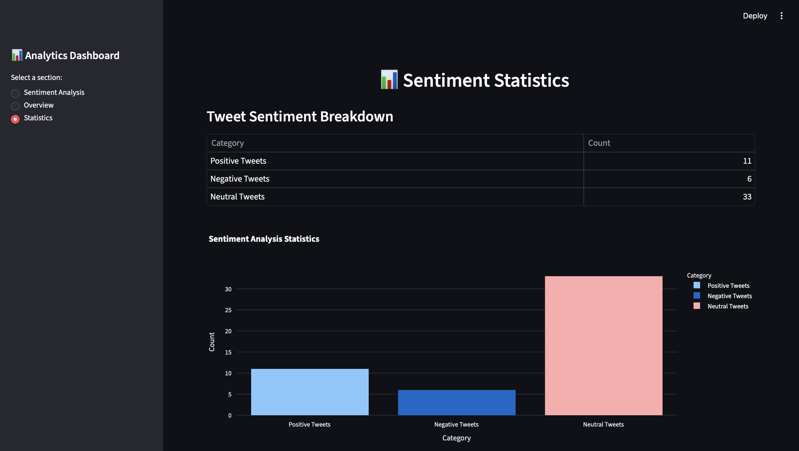

# 🌐 Social Media Sentiment Analyzer

A real-time sentiment analysis web application built with **Python**, **Streamlit**, **Twitter/X API v2**, and **BERTweet**. The application fetches recent tweets based on a user-provided keyword or hashtag and classifies them as **Positive**, **Neutral**, or **Negative** using a pre-trained transformer model.

---

## 🚀 Features

- 🔍 Search tweets using any keyword or hashtag
- 🐦 Fetch real-time tweets using the Twitter/X API v2
- 🤖 Analyze sentiment with the BERTweet transformer model
- 📊 Visualize sentiment distribution with interactive charts
- 📈 View analytics through Overview and Statistics dashboards

---

## 📸 Screenshots

### Sentiment Analysis



### Overview Dashboard



### Statistics Dashboard



---

## 🛠️ Tech Stack

- Python
- Streamlit
- Twitter/X API v2
- Hugging Face Transformers (BERTweet)
- PyTorch
- Pandas
- Plotly
- python-dotenv

---

## ⚙️ Installation

### Clone the repository

```bash
git clone https://github.com/Nishant1016/social-media-sentiment-analyzer.git
cd "Sentiment Analysis"
```

### Create and activate a virtual environment

**macOS / Linux**

```bash
python3 -m venv .venv
source .venv/bin/activate
```

**Windows**

```bash
python -m venv .venv
.venv\Scripts\activate
```

### Install dependencies

```bash
pip install -r requirements.txt
```

### Configure your Twitter/X API Bearer Token

Create a `.env` file in the project directory.

```env
BEARER_TOKEN=your_bearer_token_here
```

### Run the application

```bash
streamlit run sentiment.py
```

---

## 📂 Project Structure

```text
Sentiment Analysis/
│
├── screenshots/
│   ├── sentiment-analysis.png
│   ├── overview-dashboard.png
│   └── statistics-dashboard.png
│
├── sentiment.py
├── requirements.txt
├── README.md
├── .gitignore
└── .env
```

---

## 🔄 How It Works

1. Enter a keyword or hashtag.
2. Choose the number of tweets to analyze.
3. Fetch recent tweets using the Twitter/X API.
4. Analyze each tweet using the BERTweet sentiment model.
5. Display sentiment insights with interactive charts and statistics.

---

## 📌 Notes

- The BERTweet model is downloaded automatically the first time the application runs.
- Twitter/X API results depend on API limits and the availability of recent tweets.
- Keep your `.env` file private and never commit API keys to GitHub.

---


